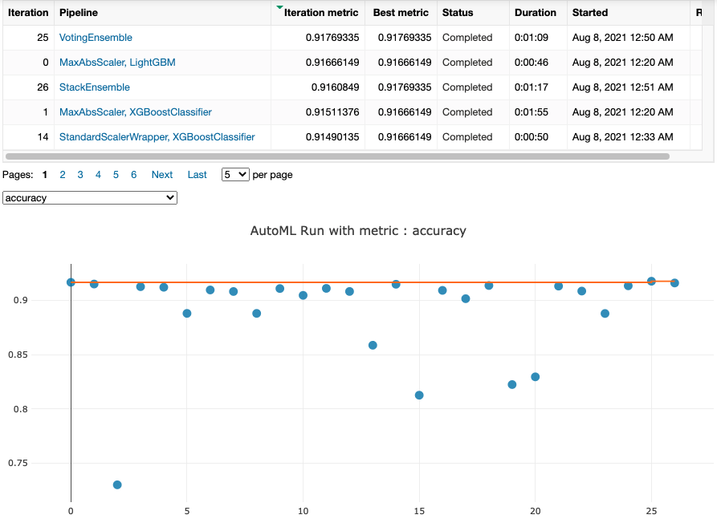
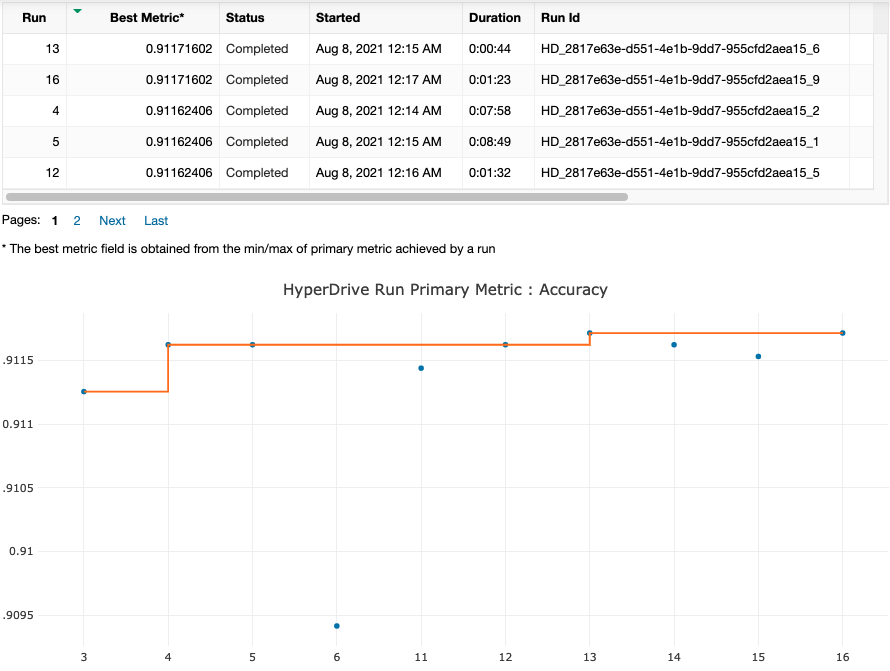

# Optimizing an ML Pipeline in Azure

## Overview
This project is part of the Udacity Azure ML Nanodegree.
In this project, we build and optimize an Azure ML pipeline using the Python SDK and a provided Scikit-learn model.
This model is then compared to an Azure AutoML run.

## Summary

The dataset contains data about the customer demographic for direct marketing campaigns. The data contains features 
pertaining to individuals age, sex, education and other features, from which its determined if they can be targeted 
for marketing campaign which would lead to deposit. The associated data is referenced from the open source [UCI Machine 
Learning Repository](https://archive.ics.uci.edu/ml/datasets/bank+marketing).

The best performing model was generated through the Azure AutoML module which identified Voting Assembler as the best 
module among various combination of model. The model performed slightly better than the Scikit Learn based Logistic 
Regression Model.

## Scikit-learn Pipeline
**Explain the pipeline architecture, including data, hyperparameter tuning, and classification algorithm.**
The scikit learn pipeline is a classification model built using the `ScriptRunConfig`, which is one the core 
functionality of Azure Machine Learning. The pipeline intakes an yaml file to  build the environment for the each child 
experiment. The data is sent to the pipeline using pandas dataframe. The `train.py` script implements a logistic 
regression model with 2 hyperparameters i.e. Regularization and Max Iteration. The score is calculated through accuracy 
of the model outcome. For my hyperdrive experiment the best accuracy is calculated at `0.912`

I have decided to use the following hyperparameter for tuning:
```python
ps = RandomParameterSampling({
        "--C":uniform(0.01,1),
        "--max_iter": choice(50, 80, 100)})
```
The benefit of choosing random parameter for regularization is to find the optimum value to maximize accuracy.
The outcome can be more optimized by `BayesianParameterSampling` as well, wherein finding the hyperparameter is based on the 
metrics, but it doesn't support early termination policy. With `RandomParameterSampling` we can get a better idea of the
search space and they can further refine after the initial runs.

**What are the benefits of the early stopping policy you chose?**
The early termination policy is based on the slack factor and evaluation interval. The idea is to check in the interval 
of metric reported and see if the change in metric is significant enough to carry on more intervals. The calculation of
this change is determined by the formula `(last_interval_metric/(1+slack_factor))`[link](https://docs.microsoft.com/en-us/azure/machine-learning/how-to-tune-hyperparameters#bandit-policy)
```python
policy = BanditPolicy(evaluation_interval=2, slack_factor=0.1)
```
## AutoML

Among the basket of ensemble models the AutoML was able to identify `VotingEnsemble` as the optimum model. The accuracy 
associated with the model is `0.918` 
## Pipeline comparison

As evident both the runs performed really well with accuracy almost similar, having a minor difference of 0.6% 
lead by the AutoML pipeline. The architecture of the pipelines differed in the sense of the model being used. As the 
Hyperdrive pipeline just utilized logistic regression it lacked flexibility to a small extent when compared to the 
AutoML pipeline.

But considering the caveat of extended use of resources the hyperdrive performed well with the early termination policy.



## Future work
Witnessing the improved results from the Hyperdrive pipeline, fine tuning the hyperparamter space using Bayesian Sampling 
method would be an interesting experiment. This would help identify any other space in the hyperparameter which has been
missed by the RandomSampling. In case of AutoML, based on the basket of models executed, increasing cross validation and
blocking low performing model might give a better outlook of features. 

